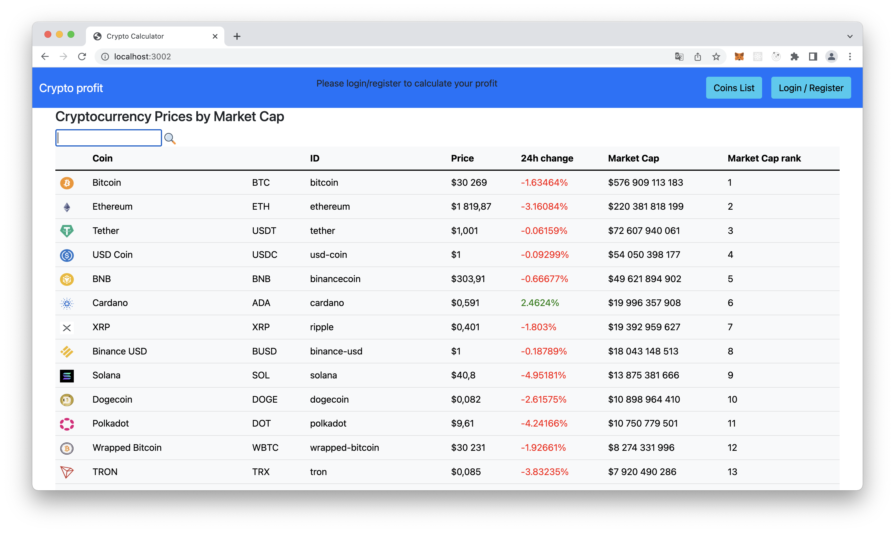
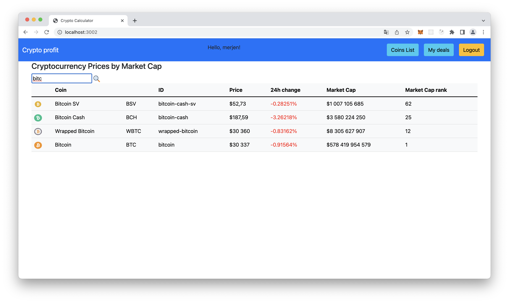
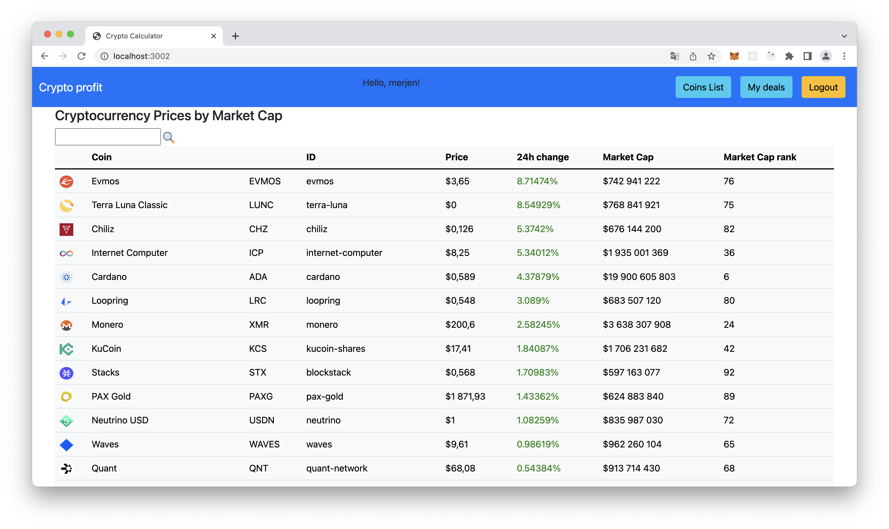
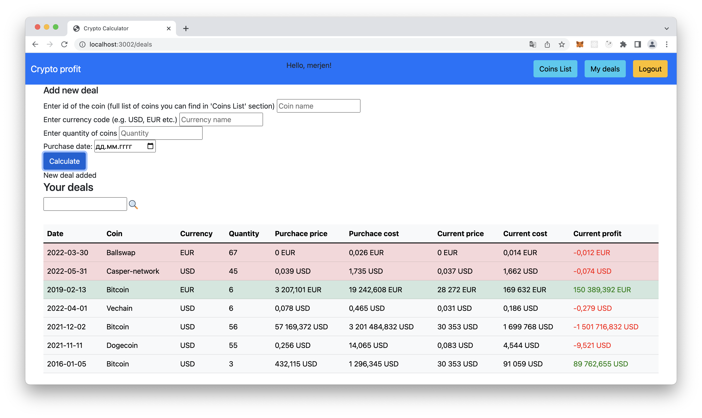

# crypto-calculator
### 🖥 Stack:
Node.js, Express, Handlebars, PostgreSQL, Sequelize, Bootstrap, CoinGecko API, Bcrypt, express-session

---

Run with 'npm start'

"Crypto Profit" is an application for crypto investors that helps to calculate profit or loss in current crypto wallet.

On the main page you can see top 100 coins due to current market capitalization:

I used CoinGecko API to download data.
I also implemented searching by coin name and id:

and  sorting by price, 24h change and market capitalization. This is an example of sorting by 24h price chaange:

After registration/login you can use main functionality in your personal account.
Here you can calculate profit or loss from the coin that you have now in your wallet.
Add coin id, currency used to pay for the purchase, quantity of coins and purchase date and the application will calculate current profit/loss from your deal:

Here I take historical price and current price of the coins from CoinGecko using API and calculate current profit/loss.
I also implemented searching by coin name and sorting by any column.

To make searching coin id easily I added "Coin List" table with coin names and ids with searching possibility.

**Plans for development:** redesign, adding functionality e.g. deleting deals, etc.
